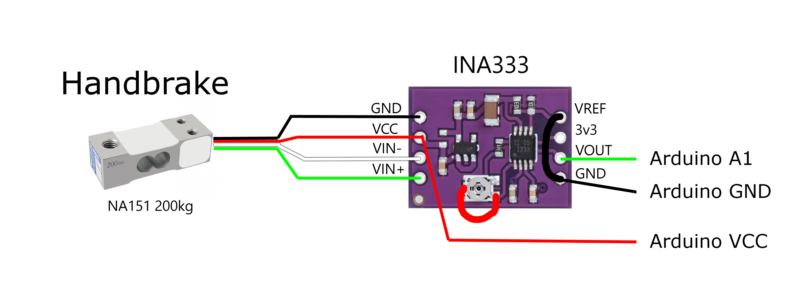

# CNCDan - Load Cell Handbrake

A load cell based handbrake design that's compatible with all of my other DIY Sim Racing projects.

[Project Video Link](https://youtu.be/xzpE0UGo8F0)

There are two different versions of the handbrake design, "Printed" and "Laser cut".
The laser cut version does still have some printed components, but the printed version does not require any laser cut parts!

Both versions are based around the same NA151 200kg Load cell - https://www.aliexpress.com/item/1005005510555008.html

And the INA333 amplifier board - https://www.aliexpress.com/item/1005007130064459.html

The files are split up into folders for each version. I've supplied STEP files for the parts that need to be laser cut, and STL files for any of the printed components! Each file has an x number at the end to denote how many copies of that part need to be made.

The "TPE Brake Bushing" file should be printed in flexible filament and without external walls to allow the print to compress nicely. I printed mine at 75% infill but you can tune that number up and down to vary the hardness.

Code to support both versions of the handbrake is now included in the [H-Shifter](https://github.com/dmcke5/H-Shifter) software. If you don't already have the shifter, this code can still be used without any modifications. Here is a wiring diagram to connect the Load cell to the INA333 board and then your Arduino. Make sure you include the jumpers across the potentiometer and between VREF and GND:

You'll also need the following items:

1x M6 Clevis - https://www.aliexpress.com/item/1005001383989512.html

1x M6x25 Washer - https://www.aliexpress.com/item/1005008724152831.html

22mm Diameter 70mm Long 3mm Wire Spring - https://www.aliexpress.com/item/1005007839215181.html

1x M6x140mm - https://www.aliexpress.com/item/1005008952546224.html

2x 625 Bearings - https://www.aliexpress.com/item/1005006600483688.html

1x 6x12x8 Retaining Collar - https://www.aliexpress.com/item/1005004975920947.html

3x M5x50 (45's would be acceptable for the Laser cut version) - https://www.aliexpress.com/item/32965712827.html

3x M5 Nyloc Nut - https://www.aliexpress.com/item/1005008280044118.html

#### Extra parts for Laser Cut Version Only

2x M6 Nyloc Nut - https://www.aliexpress.com/item/1005008280044118.html

2x M6x20 - https://www.aliexpress.com/item/32965712827.html

2x M5x35 - https://www.aliexpress.com/item/32965712827.html

#### Extra parts for Printed Version Only

2x M5x60 - https://www.aliexpress.com/item/32965712827.html

1x 10mm Shaft 350mm Long - https://www.aliexpress.com/item/1005006293171727.html
