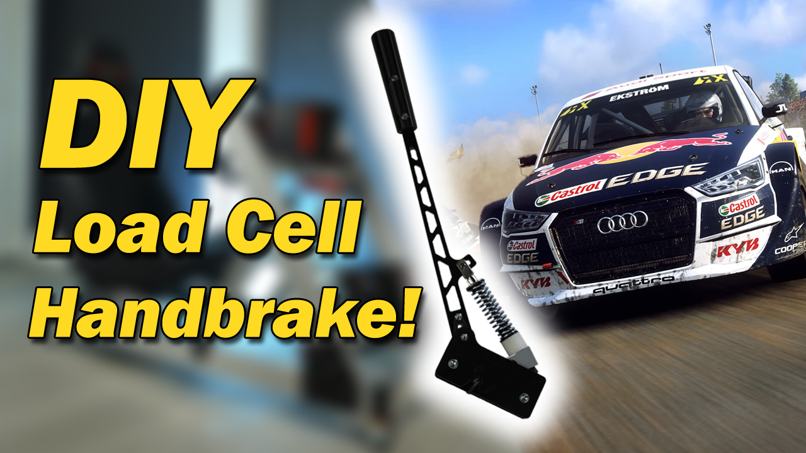

# CNCDan - Load Cell Handbrake
A load cell based handbrake design that's compatible with all of my other DIY Sim Racing projects.

[Video Link](https://youtu.be/xzpE0UGo8F0)

There are two different versions of the handbrake design, "Printed" and "Laser cut".
The laser cut version does still have some printed components, but the printed version does not require any laser cut parts!

Both versions are based around the same NA151 200kg Load cell - https://www.aliexpress.com/item/1005005510555008.html

The files are split up into folders for each version. I've supplied STEP files for the parts that need to be laser cut, and STL files for any of the printed components! Each file has an x number at the end to denote how many copies of that part need to be made.

The "TPE Brake Bushing" file should be printed in flexible filament and without external walls to allow the print to compress nicely. I printed mine at 75% infill but you can tune that number up and down to vary the hardness.

Code to support both versions of the handbrake is now included in the [H-Shifter](https://github.com/dmcke5/H-Shifter) software. If you don't already have the shifter, this code can still be used without any modifications.

